# 🏗️ Architecture Documentation

This document provides a deep dive into the technical architecture of the Group Tree Membership Visualizer.

## 📋 Table of Contents

- [Overview](#overview)
- [Technology Stack](#technology-stack)
- [Application Architecture](#application-architecture)
- [Data Flow](#data-flow)
- [Component Architecture](#component-architecture)
- [API Design](#api-design)
- [Authentication Flow](#authentication-flow)
- [State Management](#state-management)
- [Performance Optimizations](#performance-optimizations)
- [Security Architecture](#security-architecture)
- [Deployment Architecture](#deployment-architecture)

## 🎯 Overview

The Group Tree Membership Visualizer is a modern web application built with Next.js 15 and deployed on Azure Static Web Apps. It provides an interactive visualization of Microsoft Entra ID (Azure AD) group memberships using D3.js for rendering hierarchical tree structures.

### Key Design Principles

- **Security First**: All API access uses secure authentication patterns
- **Performance**: Optimized for large organizations with thousands of users/groups
- **Scalability**: Serverless architecture scales automatically
- **User Experience**: Responsive design with smooth animations
- **Maintainability**: Clean TypeScript code with proper separation of concerns

## 🛠️ Technology Stack

### Frontend Stack

| Technology | Version | Purpose |
|------------|---------|---------|
| **Next.js** | 15.x | React framework with SSG |
| **TypeScript** | 5.x | Type-safe JavaScript |
| **React** | 18.x | UI component library |
| **Tailwind CSS** | 3.x | Utility-first CSS framework |
| **D3.js** | 7.x | Data visualization library |

### Backend Stack

| Technology | Version | Purpose |
|------------|---------|---------|
| **Azure Functions** | 4.x | Serverless API endpoints |
| **Microsoft Graph SDK** | 3.x | Azure AD API integration |
| **MSAL.js** | 3.x | Client-side authentication library |

### Infrastructure

| Service | Purpose |
|---------|---------|
| **Azure Static Web Apps** | Frontend hosting + API |
| **Azure Active Directory** | Identity provider |
| **Microsoft Graph API** | Data source |
| **GitHub Actions** | CI/CD pipeline |

## 🏛️ Application Architecture

```mermaid
graph TB
    User[👤 User] --> SWA[🌐 Azure Static Web App]
    SWA --> Frontend[⚛️ Next.js Frontend]
    SWA --> API[🔧 Azure Functions API]
    
    Frontend --> MSAL[🔐 MSAL.js Authentication]
    Frontend --> Cache[💾 Client-side Cache]
    API --> Graph[📊 Microsoft Graph API]
    
    MSAL --> AAD[🏢 Azure Active Directory]
    Graph --> AAD
    
    Frontend --> D3[📈 D3.js Visualization]
    
    API --> GraphSDK[📚 Graph SDK]
    API --> AuthMiddleware[🛡️ Auth Middleware]
    
    MSAL -.-> API
    note[Bearer tokens passed to API]
```



### Architecture Layers

#### 1. Presentation Layer (Frontend)
- **React Components**: Modular UI components
- **D3.js Integration**: Custom visualization components
- **Tailwind Styling**: Utility-first CSS approach
- **State Management**: React hooks and context

#### 2. API Layer (Backend)
- **Azure Functions**: Serverless API endpoints
- **Authentication Middleware**: Token validation
- **Graph Service**: Microsoft Graph API wrapper
- **Error Handling**: Centralized error management

#### 3. Integration Layer
- **MSAL.js Authentication**: OAuth 2.0 + PKCE for client-side authentication
- **Microsoft Graph SDK**: Typed API client
- **Caching Layer**: Performance optimization

#### 4. Infrastructure Layer
- **Azure Static Web Apps**: Hosting platform
- **Azure Active Directory**: Identity provider
- **Content Delivery Network**: Global distribution

## 🔄 Data Flow

### User Search Flow


### Group Membership Flow


## 🧩 Component Architecture

### Frontend Components

```
src/
├── app/
│   ├── layout.tsx              # Root layout with metadata
│   ├── page.tsx                # Landing page (redirects)
│   ├── simple-page.tsx         # Main application page
│   └── globals.css             # Global styles and animations
├── components/
│   ├── ui/                     # Reusable UI components
│   │   ├── Button.tsx
│   │   ├── Input.tsx
│   │   └── LoadingSpinner.tsx
│   ├── AuthProvider.tsx        # MSAL authentication provider
│   ├── LoginButton.tsx         # MSAL login component
│   ├── TreeVisualization.tsx   # D3.js tree visualization
│   ├── UserSearch.tsx          # User search component
│   └── GroupSearch.tsx         # Group search component
├── lib/
│   ├── api-graph-service.ts    # Microsoft Graph API client
│   ├── auth-config.ts          # MSAL configuration
│   ├── msal-auth-service.ts    # MSAL authentication service
│   └── utils.ts                # Utility functions
└── types/
    ├── graph.ts                # Microsoft Graph types
    └── components.ts           # Component prop types
```

### API Structure

```
api/
├── auth/
│   ├── test.ts                 # Authentication test endpoint
│   └── me.ts                   # Current user info
├── search/
│   ├── users.ts                # User search endpoint
│   └── groups.ts               # Group search endpoint
├── users/
│   └── [id]/
│       └── groups.ts           # User's group memberships
├── groups/
│   └── [id]/
│       ├── members.ts          # Group members
│       └── parents.ts          # Parent groups
├── debug.ts                    # Debug/health check
└── shared/
    ├── auth-middleware.ts      # Authentication middleware
    ├── graph-client.ts         # Graph SDK initialization
    └── error-handler.ts        # Error handling utilities
```

### Component Communication

```typescript
// Component hierarchy and data flow
interface AppState {
  searchMode: 'users' | 'groups';
  selectedUser: User | null;
  selectedGroup: Group | null;
  treeData: TreeNode[];
  loading: boolean;
  error: string | null;
}

// Props flow
MainApp → UserSearch → SearchResults → TreeVisualization
       ↳ GroupSearch → GroupResults → TreeVisualization
```

## 🔌 API Design

### RESTful Endpoints

| Method | Endpoint | Purpose | Auth Required |
|--------|----------|---------|---------------|
| `GET` | `/api/auth/me` | Get current user info | ✅ |
| `GET` | `/api/debug` | Health check & config | ✅ |
| `POST` | `/api/search/users` | Search for users | ✅ |
| `POST` | `/api/search/groups` | Search for groups | ✅ |
| `GET` | `/api/users/{id}/groups` | Get user's groups | ✅ |
| `GET` | `/api/groups/{id}/members` | Get group members | ✅ |
| `GET` | `/api/groups/{id}/parents` | Get parent groups | ✅ |

### Request/Response Schemas

#### User Search Request
```typescript
interface UserSearchRequest {
  query: string;
  limit?: number;
}
```

#### User Search Response
```typescript
interface UserSearchResponse {
  users: {
    id: string;
    displayName: string;
    mail: string;
    userPrincipalName: string;
  }[];
  totalCount: number;
}
```

#### Group Tree Response
```typescript
interface GroupTreeResponse {
  tree: TreeNode[];
  metadata: {
    totalGroups: number;
    emptyGroups: string[];
    maxDepth: number;
  };
}

interface TreeNode {
  id: string;
  name: string;
  type: 'user' | 'group';
  isEmpty?: boolean;
  children: TreeNode[];
  parents?: TreeNode[];
}
```

### Error Handling

```typescript
interface APIError {
  error: string;
  message: string;
  statusCode: number;
  details?: any;
}

// Standard error responses
const errorResponses = {
  401: { error: 'Unauthorized', message: 'Authentication required' },
  403: { error: 'Forbidden', message: 'Insufficient permissions' },
  404: { error: 'Not Found', message: 'Resource not found' },
  429: { error: 'Too Many Requests', message: 'Rate limit exceeded' },
  500: { error: 'Internal Server Error', message: 'An unexpected error occurred' }
};
```

## 🔐 Authentication Flow

### MSAL.js Configuration

```typescript
const msalConfig: Configuration = {
  auth: {
    clientId: process.env.NEXT_PUBLIC_AZURE_CLIENT_ID!,
    authority: `https://login.microsoftonline.com/${process.env.AZURE_TENANT_ID}`,
    redirectUri: typeof window !== 'undefined' ? window.location.origin : 'https://your-app.azurestaticapps.net',
    postLogoutRedirectUri: typeof window !== 'undefined' ? window.location.origin : 'https://your-app.azurestaticapps.net',
  },
  cache: {
    cacheLocation: 'localStorage',
    storeAuthStateInCookie: false,
  },
  system: {
    allowNativeBroker: false,
    loggerOptions: {
      loggerCallback: (level, message, containsPii) => {
        if (containsPii) return;
        console.log(`[MSAL] ${message}`);
      },
      logLevel: LogLevel.Info
    }
  }
};

// Login request with required scopes
export const loginRequest: PopupRequest = {
  scopes: ['openid', 'profile', 'User.Read'],
  prompt: 'select_account'
};
```

### Token Acquisition Flow


### Bearer Token Authentication

```typescript
// Authentication middleware for API endpoints
export async function withAuth(request: HttpRequest, handler: Function) {
  try {
    const authHeader = request.headers.get('authorization');
    if (!authHeader?.startsWith('Bearer ')) {
      throw new Error('Missing or invalid authorization header');
    }
    
    const token = authHeader.substring(7);
    const validatedToken = await validateBearerToken(token);
    const graphClient = getOnBehalfOfGraphClient(token);
    
    return await handler(request, { user: validatedToken, graph: graphClient });
  } catch (error) {
    return {
      status: 401,
      body: { error: 'Authentication failed', message: error.message }
    };
  }
}

// Token validation function
const validateBearerToken = async (token: string): Promise<UserInfo> => {
  const decodedToken = jwt.decode(token, { complete: true });
  
  // Verify token signature, expiration, audience, issuer
  const publicKey = await getSigningKey(decodedToken.header.kid);
  const isValid = jwt.verify(token, publicKey, {
    audience: process.env.AZURE_CLIENT_ID,
    issuer: `https://login.microsoftonline.com/${process.env.AZURE_TENANT_ID}/v2.0`
  });
  
  if (!isValid) {
    throw new Error('Invalid token');
  }
  
  return decodedToken.payload;
};
```

## 🗃️ State Management

### MSAL React State Pattern

```typescript
// MSAL authentication state management
const useMsalAuthentication = () => {
  const { instance, accounts } = useMsal();
  const [isAuthenticated, setIsAuthenticated] = useState(false);
  const [accessToken, setAccessToken] = useState<string | null>(null);
  
  useEffect(() => {
    setIsAuthenticated(accounts.length > 0);
  }, [accounts]);

  const login = async () => {
    try {
      const response = await instance.loginPopup(loginRequest);
      setAccessToken(response.accessToken);
      return response;
    } catch (error) {
      console.error('Login failed:', error);
      throw error;
    }
  };

  const logout = async () => {
    await instance.logoutPopup();
    setAccessToken(null);
  };

  const getAccessToken = async (scopes: string[]) => {
    if (!accounts[0]) throw new Error('No active account');
    
    try {
      const response = await instance.acquireTokenSilent({
        scopes,
        account: accounts[0]
      });
      return response.accessToken;
    } catch (error) {
      // Fallback to popup if silent acquisition fails
      const response = await instance.acquireTokenPopup({ scopes });
      return response.accessToken;
    }
  };

  return { isAuthenticated, login, logout, getAccessToken };
};

// Main application state
const useAppState = () => {
  const [state, setState] = useState<AppState>({
    searchMode: 'users',
    selectedUser: null,
    selectedGroup: null,
    treeData: [],
    loading: false,
    error: null
  });

  // State update functions
  const setSearchMode = (mode: 'users' | 'groups') => {
    setState(prev => ({ ...prev, searchMode: mode, error: null }));
  };

  const setSelectedUser = async (user: User) => {
    setState(prev => ({ ...prev, loading: true, error: null }));
    try {
      const treeData = await ApiGraphService.getUserGroups(user.id);
      setState(prev => ({ 
        ...prev, 
        selectedUser: user, 
        treeData, 
        loading: false 
      }));
    } catch (error) {
      setState(prev => ({ 
        ...prev, 
        error: error.message, 
        loading: false 
      }));
    }
  };

  return { state, setSearchMode, setSelectedUser };
};
```

### Client-side Caching

```typescript
// Simple in-memory cache with TTL
class MemoryCache {
  private cache = new Map<string, { data: any; expires: number }>();

  set(key: string, data: any, ttlSeconds = 300) {
    this.cache.set(key, {
      data,
      expires: Date.now() + (ttlSeconds * 1000)
    });
  }

  get(key: string) {
    const item = this.cache.get(key);
    if (!item || Date.now() > item.expires) {
      this.cache.delete(key);
      return null;
    }
    return item.data;
  }
}
```

## ⚡ Performance Optimizations

### Frontend Optimizations

1. **Component Memoization**
```typescript
const TreeVisualization = memo(({ data }: { data: TreeNode[] }) => {
  return useMemo(() => {
    return <D3Tree data={data} />;
  }, [data]);
});
```

2. **Lazy Loading**
```typescript
const GroupSearch = lazy(() => import('./GroupSearch'));
const UserSearch = lazy(() => import('./UserSearch'));
```

3. **Virtual Scrolling** (for large lists)
```typescript
const VirtualizedList = ({ items, renderItem }) => {
  const [visibleStart, visibleEnd] = useVirtualization(items.length);
  return items.slice(visibleStart, visibleEnd).map(renderItem);
};
```

### API Optimizations

1. **Request Batching**
```typescript
// Batch multiple Graph API requests
const batchRequests = async (requests: GraphRequest[]) => {
  const batch = graph.createBatch();
  requests.forEach(req => batch.add(req));
  return await batch.execute();
};
```

2. **Selective Field Queries**
```typescript
// Only request needed fields
const users = await graph.users.select([
  'id', 'displayName', 'mail', 'userPrincipalName'
]).get();
```

3. **Pagination**
```typescript
let users = [];
let pageIterator = await graph.users.top(100).get();

while (pageIterator.hasNext) {
  const nextPage = await pageIterator.next();
  users.push(...nextPage.value);
}
```

### D3.js Optimizations

1. **Efficient Updates**
```typescript
// Use D3's data join pattern for efficient updates
const updateTree = (data: TreeNode[]) => {
  const nodes = svg.selectAll('.node')
    .data(data, d => d.id);
  
  // Enter
  const nodeEnter = nodes.enter()
    .append('g')
    .attr('class', 'node');
  
  // Update
  nodes.merge(nodeEnter)
    .transition()
    .attr('transform', d => `translate(${d.x},${d.y})`);
  
  // Exit
  nodes.exit()
    .transition()
    .remove();
};
```

2. **Canvas Rendering** (for large datasets)
```typescript
// Use canvas for better performance with 1000+ nodes
const renderTreeOnCanvas = (canvas: HTMLCanvasElement, data: TreeNode[]) => {
  const context = canvas.getContext('2d');
  const simulation = d3.forceSimulation(data)
    .force('link', d3.forceLink().id(d => d.id))
    .force('charge', d3.forceManyBody())
    .force('center', d3.forceCenter(width / 2, height / 2));
};
```

## 🛡️ Security Architecture

### Authentication Security

1. **Bearer Token Validation**
```typescript
const validateBearerToken = async (token: string): Promise<UserInfo> => {
  const decodedToken = jwt.decode(token, { complete: true });
  
  // Get public key for signature verification
  const publicKey = await getSigningKey(decodedToken.header.kid);
  
  // Verify signature, expiration, audience, issuer
  const payload = jwt.verify(token, publicKey, {
    audience: process.env.NEXT_PUBLIC_AZURE_CLIENT_ID,
    issuer: `https://login.microsoftonline.com/${process.env.AZURE_TENANT_ID}/v2.0`,
    clockTolerance: 60 // Allow 60 seconds clock skew
  });
  
  return payload as UserInfo;
};
```

2. **MSAL Security Configuration**
```typescript
const msalConfig: Configuration = {
  auth: {
    clientId: process.env.NEXT_PUBLIC_AZURE_CLIENT_ID!,
    authority: `https://login.microsoftonline.com/${process.env.AZURE_TENANT_ID}`,
    knownAuthorities: [`${process.env.AZURE_TENANT_ID}.b2clogin.com`],
    redirectUri: window.location.origin,
    postLogoutRedirectUri: window.location.origin,
    navigateToLoginRequestUrl: false
  },
  cache: {
    cacheLocation: 'localStorage', // Use localStorage for persistence
    storeAuthStateInCookie: false,  // Don't use cookies for SPA
    secureCookies: true
  },
  system: {
    allowNativeBroker: false, // Disable for web apps
    loggerOptions: {
      logLevel: LogLevel.Error, // Only log errors in production
      piiLoggingEnabled: false  // Don't log PII
    }
  }
};
```

2. **Secure Headers**
```typescript
const securityHeaders = {
  'Strict-Transport-Security': 'max-age=31536000; includeSubDomains',
  'X-Content-Type-Options': 'nosniff',
  'X-Frame-Options': 'DENY',
  'X-XSS-Protection': '1; mode=block',
  'Referrer-Policy': 'strict-origin-when-cross-origin'
};
```

### Data Protection

1. **Input Sanitization**
```typescript
const sanitizeInput = (input: string): string => {
  return input.replace(/[<>\"']/g, '').trim().substring(0, 100);
};
```

2. **Rate Limiting**
```typescript
const rateLimiter = new Map<string, { count: number; resetTime: number }>();

const checkRateLimit = (clientId: string, limit = 100, windowMs = 900000) => {
  const now = Date.now();
  const client = rateLimiter.get(clientId) || { count: 0, resetTime: now + windowMs };
  
  if (now > client.resetTime) {
    client.count = 0;
    client.resetTime = now + windowMs;
  }
  
  client.count++;
  rateLimiter.set(clientId, client);
  
  return client.count <= limit;
};
```

## 🚀 Deployment Architecture

### Azure Static Web Apps

```yaml
# GitHub Actions deployment
name: Azure Static Web Apps CI/CD

on:
  push:
    branches: [ main ]
  pull_request:
    types: [opened, synchronize, reopened, closed]
    branches: [ main ]

jobs:
  build_and_deploy_job:
    runs-on: ubuntu-latest
    steps:
    - uses: actions/checkout@v3
      with:
        submodules: true
    
    - name: Build And Deploy
      uses: Azure/static-web-apps-deploy@v1
      with:
        azure_static_web_apps_api_token: ${{ secrets.AZURE_STATIC_WEB_APPS_API_TOKEN }}
        repo_token: ${{ secrets.GITHUB_TOKEN }}
        action: "upload"
        app_location: "/"
        api_location: "api"
        output_location: "out"
```

### Infrastructure as Code

```json
{
  "$schema": "https://schema.management.azure.com/schemas/2019-04-01/deploymentTemplate.json#",
  "contentVersion": "1.0.0.0",
  "parameters": {
    "staticWebAppName": {
      "type": "string",
      "metadata": {
        "description": "Name of the static web app"
      }
    }
  },
  "resources": [
    {
      "type": "Microsoft.Web/staticSites",
      "apiVersion": "2022-03-01",
      "name": "[parameters('staticWebAppName')]",
      "location": "Central US",
      "properties": {
        "repositoryUrl": "https://github.com/OfirGavish/Group-Tree-Membership-Visualizer",
        "branch": "main",
        "buildProperties": {
          "appLocation": "/",
          "apiLocation": "/api",
          "outputLocation": "out"
        }
      }
    }
  ]
}
```

### Monitoring and Observability

```typescript
// Application Insights integration
import { ApplicationInsights } from '@azure/monitor-opentelemetry-exporter';

const appInsights = new ApplicationInsights({
  connectionString: process.env.APPLICATIONINSIGHTS_CONNECTION_STRING
});

// Custom telemetry
const trackEvent = (name: string, properties?: any) => {
  appInsights.trackEvent({ name, properties });
};

const trackError = (error: Error, properties?: any) => {
  appInsights.trackException({ exception: error, properties });
};
```

## 📊 Scalability Considerations

### Horizontal Scaling

- **Azure Static Web Apps**: Automatically scales globally
- **Azure Functions**: Scales based on demand
- **CDN Integration**: Reduces latency worldwide

### Vertical Scaling Patterns

1. **Database Optimization**: Use Graph API efficiently
2. **Caching Strategy**: Multiple cache layers
3. **Code Splitting**: Lazy load components
4. **Image Optimization**: Optimized assets

### Performance Monitoring

```typescript
// Performance metrics collection
const trackPerformance = (operation: string, duration: number) => {
  console.log(`Operation: ${operation}, Duration: ${duration}ms`);
  
  // Send to Application Insights
  appInsights.trackDependency({
    name: operation,
    data: operation,
    duration,
    success: true
  });
};
```

---

This architecture provides a robust, scalable, and secure foundation for visualizing organizational group structures. The modular design allows for easy maintenance and future enhancements while maintaining high performance and security standards.
