# Fully Automated Deployment Guide

This guide explains the **ultimate deployment solution** for the Group Tree Membership Visualizer - a completely automated deployment that requires **zero manual steps** and **no GitHub authorization**.

## 🎯 Overview

The fully automated deployment method uses:
1. **Azure Storage Account** with public anonymous access to host pre-built files
2. **ARM Template with Deployment Script** that automatically downloads and deploys the application
3. **GitHub Actions** that build and upload packages to storage automatically

## ✨ Benefits

### 🚀 For End Users
- **Zero-touch deployment**: Click Deploy to Azure → Wait → Done
- **No GitHub account required**: Perfect for organizational IT departments
- **No manual scripts**: Everything happens automatically in Azure
- **Always up-to-date**: Gets the latest stable release automatically

### 🏢 For Organizations
- **Public distribution ready**: Share Deploy to Azure button publicly
- **IT-friendly**: No external dependencies or complex setup
- **Reliable**: No dependency on GitHub service availability
- **Auditable**: All deployment steps logged in Azure

### 👨‍💻 For Developers
- **Automated releases**: GitHub Actions build and upload packages automatically
- **Version control**: Support for specific versions or latest
- **Scalable**: Deploy to unlimited environments without GitHub rate limits

## 🏗️ Architecture

```mermaid
graph TB
    Dev[👨‍💻 Developer] --> GitHub[📦 GitHub Actions]
    GitHub --> Storage[🗄️ Azure Storage<br/>Public Access]
    
    User[👤 End User] --> Portal[🌐 Azure Portal]
    Portal --> ARM[📋 ARM Template]
    ARM --> Script[⚙️ Deployment Script]
    Script --> Storage
    Storage --> Script
    Script --> SWA[🌐 Static Web App]
    
    SWA --> App[✨ Ready Application]
    
    classDef automated fill:#e1f5fe
    classDef user fill:#f3e5f5
    classDef azure fill:#fff3e0
    
    class GitHub,Script,Storage automated
    class Dev,User user
    class Portal,ARM,SWA azure
```



## 🛠️ Setup Process (One-time, for Repository Owners)

### Step 1: Create Storage Account

```powershell
# Download and run the storage setup script
Invoke-WebRequest -Uri "https://raw.githubusercontent.com/OfirGavish/Group-Tree-Membership-Visualizer/main/setup-storage-account.ps1" -OutFile "setup-storage-account.ps1"

# Run setup (replace with your values)
.\setup-storage-account.ps1 -StorageAccountName "grouptreevisualizer" -ResourceGroupName "rg-releases"
```

### Step 2: Configure GitHub Actions

1. **Create Azure Service Principal**:
   ```bash
   az ad sp create-for-rbac --name "github-actions-gtv" --role Contributor --scopes /subscriptions/{subscription-id}/resourceGroups/rg-releases --sdk-auth
   ```

2. **Add GitHub Secret**:
   - Go to repository Settings → Secrets and variables → Actions
   - Add secret named `AZURE_CREDENTIALS` with the service principal JSON

3. **Update workflow file** (`.github/workflows/build-and-upload.yml`):
   ```yaml
   env:
     STORAGE_ACCOUNT: grouptreevisualizer  # Your storage account name
     CONTAINER_NAME: releases
   ```

### Step 3: Update ARM Template

Update `azuredeploy-automated-simple.json`:
```json
"sourceStorageAccount": {
  "type": "string",
  "defaultValue": "grouptreevisualizer",  // Your storage account name
  "metadata": {
    "description": "Storage account name where pre-built files are stored."
  }
}
```

### Step 4: Initial Package Upload

Trigger the GitHub Actions workflow to create the first package:
1. Create a release tag: `git tag v1.1.0 && git push origin v1.1.0`
2. Or manually trigger the workflow from GitHub Actions tab

## 🚀 Deployment Process (For End Users)

### Step 1: Deploy Infrastructure + Application

[](https://portal.azure.com/#create/Microsoft.Template/uri/https%3A%2F%2Fraw.githubusercontent.com%2FOfirGavish%2FGroup-Tree-Membership-Visualizer%2Fmain%2Fazuredeploy-automated-simple.json)

**Parameters:**
- **Static Web App Name**: Choose a globally unique name
- **Location**: Select region closest to your users
- **Pricing Tier**: Free (up to 100 requests/day) or Standard
- **Release Version**: "latest" (recommended) or specific version like "v1.1.0"
- **Source Storage Account**: Leave default unless using custom storage

**What happens automatically:**
1. ✅ Creates Azure Static Web App resource
2. ✅ Creates managed identity for deployment
3. ✅ Downloads latest pre-built package from storage
4. ✅ Extracts and deploys all application files
5. ✅ Configures routing and API endpoints
6. ✅ Application is ready and accessible

### Step 2: Configure Authentication (Only Manual Step)

```powershell
# Copy this command from ARM template outputs
Invoke-WebRequest -Uri "https://raw.githubusercontent.com/OfirGavish/Group-Tree-Membership-Visualizer/main/configure-app.ps1" -OutFile "configure-app.ps1"
.\configure-app.ps1 -StaticWebAppName "your-app-name"
```

### Step 3: Access Application

Visit `https://your-app-name.azurestaticapps.net` and start exploring!

## 🔄 How It Works Internally

### Build and Upload Process

1. **Developer pushes code** or creates release tag
2. **GitHub Actions triggers** the build workflow
3. **Application is built** using `npm run build`
4. **Package is created** with static files + API + documentation
5. **Package uploaded** to Azure Storage with public access
6. **Both versioned and "latest" packages** are available

### Deployment Script Process

1. **ARM template creates** Static Web App and managed identity
2. **Deployment script starts** with parameters from ARM template
3. **Script downloads** package from public storage URL
4. **Package is extracted** and validated
5. **Files are deployed** using Azure Static Web Apps deployment API
6. **Deployment is verified** with health check
7. **Application is ready** for immediate use

## 📦 Package Structure

Each package contains:
```
group-tree-visualizer-standalone-v1.1.0/
├── static/                 # Pre-built Next.js static files
│   ├── _next/             # Next.js assets
│   ├── index.html         # Main application page
│   └── ...                # Other static assets
├── api/                   # Azure Functions backend
│   ├── getUsers/          # API endpoints
│   ├── getGroups/         # 
│   └── ...                # 
├── staticwebapp.config.json # Azure SWA configuration
├── DEPLOYMENT.md          # Deployment instructions
└── configure-app.ps1      # MSAL configuration script
```

## 🔍 Monitoring and Troubleshooting

### ARM Template Deployment Logs

1. Go to Azure Portal → Resource Groups → Your RG
2. Click "Deployments" in the left menu
3. Find your deployment and click for details
4. Check "Deployment script" resource for detailed logs

### Common Issues and Solutions

| Issue | Cause | Solution |
|-------|-------|----------|
| Package download fails | Storage account not public | Check storage account public access settings |
| Deployment script times out | Large package or slow network | Use Standard tier or smaller packages |
| Application shows default page | Deployment failed silently | Check deployment script logs in Azure Portal |
| MSAL configuration fails | Insufficient permissions | Ensure user has Application Administrator role |

### Verification Steps

1. **Check Storage Access**:
   ```bash
   curl -I https://grouptreevisualizer.blob.core.windows.net/releases/group-tree-visualizer-latest.zip
   ```

2. **Verify Application Health**:
   ```bash
   curl https://your-app-name.azurestaticapps.net/api/health
   ```

3. **Check Authentication**:
   - Visit app URL
   - Click sign-in button
   - Verify MSAL authentication flow

## 🔄 Updates and Maintenance

### Automatic Updates

- **New releases**: GitHub Actions automatically upload new packages
- **Version selection**: Users can choose "latest" or specific versions
- **Rollback support**: Deploy older versions by specifying version parameter

### Manual Updates

To update an existing deployment:
1. Redeploy ARM template with newer version parameter
2. Or re-run deployment script manually with new package URL

### Security Updates

- **Storage account**: Regularly review access patterns and rotate keys
- **Managed identity**: Monitor usage and permissions
- **Application packages**: Automated security scanning in GitHub Actions

## 🎯 Best Practices

### For Repository Owners

- **Version tagging**: Use semantic versioning for releases
- **Package testing**: Test packages before uploading to storage
- **Security scanning**: Enable GitHub security features
- **Documentation**: Keep deployment docs up-to-date

### For End Users

- **Resource naming**: Use descriptive, organization-specific names
- **Region selection**: Choose regions close to your users
- **Monitoring**: Set up Azure Monitor alerts for your application
- **Backup**: Export app registration settings for disaster recovery

### For Organizations

- **Standardization**: Use consistent naming conventions
- **Governance**: Implement Azure Policy for resource compliance
- **Cost management**: Monitor costs and set up budgets
- **Access control**: Use Azure RBAC for deployment permissions

## 🆘 Support and Troubleshooting

### Getting Help

1. **GitHub Issues**: Report bugs and request features
2. **Azure Support**: For Azure-specific deployment issues
3. **Community**: Join discussions in GitHub Discussions

### Debug Mode

Enable verbose logging by modifying ARM template:
```json
"environmentVariables": [
  {
    "name": "DEBUG_MODE",
    "value": "true"
  }
]
```

### Manual Deployment (Fallback)

If automated deployment fails, fall back to standalone deployment:
1. Use `azuredeploy-standalone.json` template
2. Run `deploy-standalone.ps1` script manually
3. Use pre-built packages from storage account

---

The fully automated deployment represents the **ultimate solution** for public distribution of Azure applications, eliminating all barriers while maintaining security and reliability. 🚀
