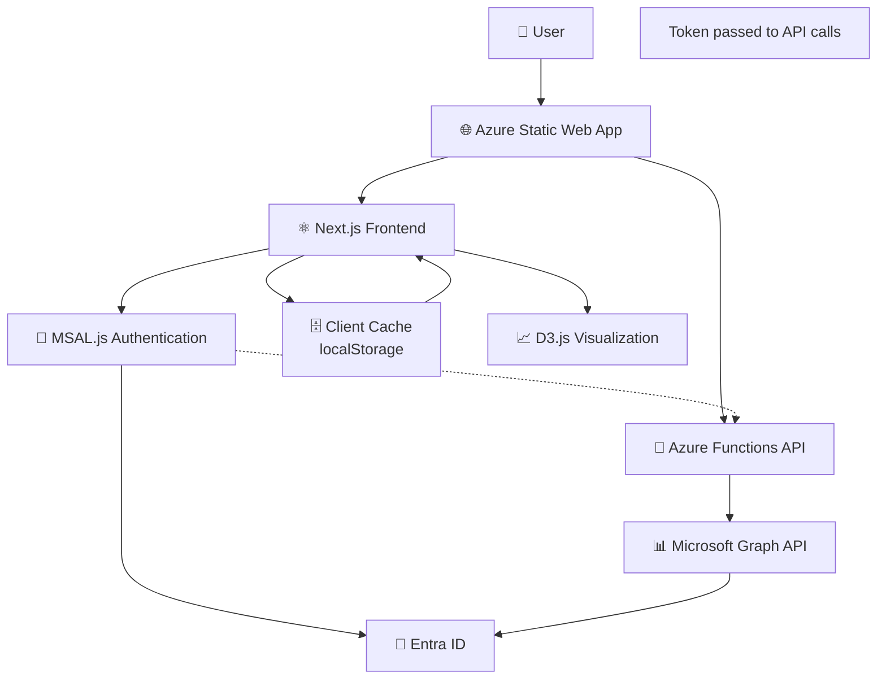

# 🌳 Group Tree Membership Visualizer

> **A beautiful, interactive Microsoft Entra ID grou4. **Automatic Configuration**: The script handles:
   - 🔧 **Dynamic Tenant ID**: Automatically detects and configures your Azure tenant
   - 🔐 **App Registration**: Sets up Single-tenant SPA app registration with delegated permissions only
   - 🌐 **Redirect URIs**: Configures proper redirect URIs for your Static Web App domain and localhost
   - ⚙️ **Environment Variables**: Configures NEXT_PUBLIC_AZURE_CLIENT_ID, AZURE_TENANT_ID
   - 🎯 **MSAL Configuration**: Updates auth-config.ts with your tenant and client ID
   - 🛡️ **PKCE Security**: Configures Proof Key for Code Exchange for secure SPA authenticationership visualizer with stunning D3.js tree visualization**

[](https://portal.azure.com/#create/Microsoft.Template/uri/https%3A%2F%2Fraw.githubusercontent.com%2FOfirGavish%2FGroup-Tree-Membership-Visualizer%2Fmain%2Fazuredeploy-automated-simple.json)
[](https://opensource.org/licenses/MIT)
[](https://nextjs.org/)
[](https://www.typescriptlang.org/)
[](https://azure.microsoft.com/services/app-service/static/)

## ✨ Features

### 🎯 Core Functionality
- **🔍 Smart Search**: Search for users, groups, and devices across your organization with real-time autocomplete
- **🌲 Interactive Tree Visualization**: Beautiful D3.js-powered hierarchical tree showing group memberships
- **👥 Triple Mode**: Switch between user-centric, group-centric, and device-centric views
- **💻 Device Support**: Explore device group memberships with device status indicators (managed/compliant)
- **🔴 Empty Group Detection**: Automatically highlights groups with no members in red
- **📱 Responsive Design**: Works seamlessly on desktop, tablet, and mobile devices

### 🎨 User Experience
- **✨ Glass Morphism UI**: Modern, elegant interface with glass-like transparency effects
- **🌊 Floating Animations**: Smooth, continuous animations for an engaging experience
- **🎛️ Triple Toggle Buttons**: Beautiful animated toggle switches between User, Group, and Device search modes
- **⚡ Real-time Updates**: Instant feedback and smooth transitions
- **🎪 Expand/Collapse**: Interactive tree nodes with smooth expand/collapse animations
- **📊 Status Indicators**: Device compliance and management status badges

### 🔐 Security & Authentication
- **🔒 MSAL Authentication**: Modern Microsoft Authentication Library for secure OAuth 2.0 flows
- **🛡️ Permission-based Access**: Respects your existing directory permissions
- **🔑 Secure API**: All API calls are authenticated with bearer tokens
- **🏢 Single Tenant**: Designed for organizational use with proper security boundaries
- **⚡ Client-side Authentication**: No server-side session management, pure client-side token handling

### 🚀 Technical Excellence
- **⚡ Serverless Architecture**: Built on Azure Static Web Apps for automatic scaling
- **🔄 Smart Caching**: Optimized performance with intelligent client-side caching
- **📊 Microsoft Graph Integration**: Direct integration with Microsoft Graph API using MSAL tokens
- **🏗️ Modern Stack**: Next.js 15, TypeScript, Tailwind CSS, MSAL.js, and D3.js

## 🎬 Demo


*Beautiful tree visualization showing group hierarchies with empty groups highlighted in red*

## 🚀 Quick Start

## 🚀 Quick Start

## 🚀 Quick Start

### Deployment Options Comparison

| Feature | Fully Automated | Standalone | GitHub-Integrated |
|---------|----------------|------------|-------------------|
| **GitHub Authorization** | ❌ Not required | ❌ Not required | ✅ Required |
| **Manual Steps** | 0️⃣ Zero-touch | 1️⃣ One script | 1️⃣ One script |
| **Public Distribution** | ✅ Perfect | ✅ Perfect | ❌ Not suitable |
| **Setup Complexity** | � Simplest | � Simple | 🟡 Simple |
| **Best For** | Everyone | IT Departments | Developers |

### Option 1: Azure Cloud Shell Deployment (Recommended) 🌟

**The most reliable one-click deployment - runs in your Azure environment!**

[](https://shell.azure.com/bash)

**Steps:**
1. **Click the Cloud Shell button** above
2. **Run the deployment command:**
   ```bash
   curl -s https://raw.githubusercontent.com/OfirGavish/Group-Tree-Membership-Visualizer/main/deploy-cloudshell.sh | bash
   ```
3. **Follow interactive prompts** (app name, region, etc.)
4. **Wait for completion** (3-5 minutes)
5. **Configure MSAL authentication** using the provided command

✨ **Cloud Shell Advantages:**
- 🚀 **Reliable**: Runs with your Azure credentials in proven environment
- 🔍 **Transparent**: See real-time progress and detailed output
- ⚡ **Fast**: Usually completes in 3-5 minutes vs. ARM template failures
- 🛠️ **Debuggable**: Full control and ability to troubleshoot interactively
- 🔒 **No GitHub Required**: Completely eliminates GitHub authorization barrier

### Option 2: Modern Bicep Deployment (For DevOps) 🆕

**The ultimate one-click solution - no scripts, no manual steps!**

[](https://portal.azure.com/#create/Microsoft.Template/uri/https%3A%2F%2Fraw.githubusercontent.com%2FOfirGavish%2FGroup-Tree-Membership-Visualizer%2Fmain%2Fazuredeploy-automated-simple.json)

1. **Click the Deploy to Azure button** above (fully automated template)
2. **Fill in the deployment parameters** (app name, location, etc.)
3. **Wait for complete deployment** (3-5 minutes)
4. **Configure MSAL Authentication** (one final step):
   ```powershell
   Invoke-WebRequest -Uri "https://raw.githubusercontent.com/OfirGavish/Group-Tree-Membership-Visualizer/main/configure-app.ps1" -OutFile "configure-app.ps1"
   .\configure-app.ps1 -StaticWebAppName "your-app-name"
   ```
5. **Done!** 🎉 Your app is ready at `https://your-app-name.azurestaticapps.net`

> **✨ Magic**: ARM template automatically downloads pre-built files from Azure Storage and deploys them - zero manual steps!

### Option 2: Standalone Deployment (For Custom Builds)

**Perfect for organizations wanting control over the deployment process**

[](https://portal.azure.com/#create/Microsoft.Template/uri/https%3A%2F%2Fraw.githubusercontent.com%2FOfirGavish%2FGroup-Tree-Membership-Visualizer%2Fmain%2Fazuredeploy-standalone.json)

1. **Click the Deploy to Azure button** above (standalone template)
2. **Fill in the deployment parameters** (app name, location, etc.)
3. **Wait for infrastructure deployment** (1-2 minutes)
4. **Copy the deployment token** from the ARM template outputs
5. **Deploy the application** by downloading and running:
   ```powershell
   # Download deployment script
   Invoke-WebRequest -Uri "https://raw.githubusercontent.com/OfirGavish/Group-Tree-Membership-Visualizer/main/deploy-standalone.ps1" -OutFile "deploy-standalone.ps1"
   
   # Deploy application (replace with your values)
   .\deploy-standalone.ps1 -StaticWebAppName "your-app-name" -DeploymentToken "your-deployment-token"
   ```
6. **Configure MSAL Authentication**:
   ```powershell
   Invoke-WebRequest -Uri "https://raw.githubusercontent.com/OfirGavish/Group-Tree-Membership-Visualizer/main/configure-app.ps1" -OutFile "configure-app.ps1"
   .\configure-app.ps1 -StaticWebAppName "your-app-name"
   ```

> **✅ Advantages**: No GitHub authorization required, works for public distribution, control over deployment timing

### Option 3: GitHub-Integrated Deployment (For Developers)

**Perfect for developers who want continuous deployment from GitHub**

[](https://portal.azure.com/#create/Microsoft.Template/uri/https%3A%2F%2Fraw.githubusercontent.com%2FOfirGavish%2FGroup-Tree-Membership-Visualizer%2Fmain%2Fazuredeploy.json)

1. **Click the Deploy to Azure button** above (uses GitHub integration)
2. **Authorize GitHub integration** when prompted
3. **Fill in the deployment parameters** (app name, repository, etc.)
4. **Wait for deployment** to complete (3-5 minutes)
5. **Configure MSAL Authentication**:
   ```powershell
   Invoke-WebRequest -Uri "https://raw.githubusercontent.com/OfirGavish/Group-Tree-Membership-Visualizer/main/configure-app.ps1" -OutFile "configure-app.ps1"
   .\configure-app.ps1 -StaticWebAppName "your-app-name"
   ```

> **⚠️ Note**: Requires GitHub authorization - not suitable for public distribution

1. **Deploy to Azure** - Choose your deployment method:

   **🆕 Standalone Deployment (Recommended for Organizations)**
   [](https://portal.azure.com/#create/Microsoft.Template/uri/https%3A%2F%2Fraw.githubusercontent.com%2FOfirGavish%2FGroup-Tree-Membership-Visualizer%2Fmain%2Fazuredeploy-standalone.json)
   
   **👨‍💻 GitHub-Integrated Deployment (For Developers)**
   [](https://portal.azure.com/#create/Microsoft.Template/uri/https%3A%2F%2Fraw.githubusercontent.com%2FOfirGavish%2FGroup-Tree-Membership-Visualizer%2Fmain%2Fazuredeploy.json)

2. **Configure Deployment**:
   - Choose your Azure subscription
   - Create a new resource group or use existing
   - Enter a unique Static Web App name
   - Select a region close to your users
   - Click "Review + Create"

3. **Post-Deployment Setup**:
   
   **For Standalone Deployment:**
   ```powershell
   # Step 1: Deploy application files using the deployment token from ARM output
   Invoke-WebRequest -Uri "https://raw.githubusercontent.com/OfirGavish/Group-Tree-Membership-Visualizer/main/deploy-standalone.ps1" -OutFile "deploy-standalone.ps1"
   .\deploy-standalone.ps1 -StaticWebAppName "your-app-name" -DeploymentToken "your-deployment-token"
   
   # Step 2: Configure MSAL authentication
   Invoke-WebRequest -Uri "https://raw.githubusercontent.com/OfirGavish/Group-Tree-Membership-Visualizer/main/configure-app.ps1" -OutFile "configure-app.ps1"
   .\configure-app.ps1 -StaticWebAppName "your-app-name"
   ```
   
   **For GitHub-Integrated Deployment:**
   ```powershell
   # Download and run the configuration script with your app name
   Invoke-WebRequest -Uri "https://raw.githubusercontent.com/OfirGavish/Group-Tree-Membership-Visualizer/main/configure-app.ps1" -OutFile "configure-app.ps1"
   .\configure-app.ps1 -StaticWebAppName "your-app-name"
   
   # The script will automatically:
   # - Install Microsoft Graph PowerShell SDK (modern replacement for deprecated AzureAD module)
   # - Get your tenant ID from Azure context
   # - Create/update App Registration with MSAL configuration
   # - Configure delegated permissions for Microsoft Graph
   # - Set up redirect URIs for MSAL authentication
   # - Configure environment variables in your Static Web App
   ```

4. **Automatic Configuration**: The script handles:
   - 🔧 **Dynamic Tenant ID**: Automatically detects and configures your Azure tenant
   - 🔐 **App Registration**: Sets up MSAL-compatible app registration with delegated permissions
   - 🌐 **Redirect URIs**: Configures proper redirect URIs for your Static Web App domain
   - ⚙️ **Environment Variables**: Configures NEXT_PUBLIC_AZURE_CLIENT_ID, AZURE_TENANT_ID
   - � **MSAL Configuration**: Updates auth-config.ts with your tenant and client ID

5. **Done!** 🎉 Your app is ready at `https://your-app-name.azurestaticapps.net`

### Option 2: Manual Setup

<details>
<summary>Click to expand manual setup instructions</summary>

#### Prerequisites
- Azure subscription
- PowerShell or Azure CLI
- Global Administrator or Application Administrator role

#### Step 1: Deploy Infrastructure
```bash
# Clone the repository
git clone https://github.com/OfirGavish/Group-Tree-Membership-Visualizer.git
cd Group-Tree-Membership-Visualizer

# Deploy using Azure CLI
az group create --name "rg-group-visualizer" --location "East US"
az deployment group create \
  --resource-group "rg-group-visualizer" \
  --template-file azuredeploy.json \
  --parameters staticWebAppName="your-unique-name"
```

#### Step 2: Configure App Registration
```powershell
# Run the configuration script
.\configure-app.ps1 -StaticWebAppName "your-unique-name"
```

#### Step 3: Grant Permissions
1. Go to [Azure Portal](https://portal.azure.com)
2. Navigate to **Azure Active Directory** > **App registrations**
3. Find "Group Tree Membership Visualizer"
4. Go to **API permissions** > **Grant admin consent**

</details>

## 🏗️ Architecture

The application follows a modern, serverless architecture with intelligent caching:



### Tech Stack

| Layer | Technology | Purpose |
|-------|------------|---------|
| **Frontend** | Next.js 15 + TypeScript | React framework with static generation |
| **Styling** | Tailwind CSS | Utility-first CSS with custom glass morphism |
| **Visualization** | D3.js v7 | Interactive tree diagrams and animations |
| **Authentication** | MSAL.js | Microsoft Authentication Library for OAuth 2.0 |
| **API** | Azure Functions | Serverless backend endpoints |
| **Data Source** | Microsoft Graph | Entra ID users and groups |
| **Hosting** | Azure Static Web Apps | Global CDN with automatic scaling |

## 📖 Available Documentation

| Document | Description |
|----------|-------------|
| **[Quick Start](#-quick-start)** | One-click Azure deployment guide |
| **[Architecture](#️-architecture)** | Technical architecture and design patterns |
| **[Security & Permissions](#-security--permissions)** | Required permissions and security features |
| **[Development](#️-development)** | Local development setup instructions |

## 🎯 Use Cases

### 👥 HR & People Operations
- **Org Chart Visualization**: Understand reporting structures through group memberships
- **Access Reviews**: Identify users with excessive group memberships
- **Onboarding/Offboarding**: Visualize user access patterns

### 🔐 Security & Compliance
- **Permission Audits**: Review group-based access permissions
- **Empty Group Cleanup**: Identify and clean up unused security groups
- **Access Governance**: Understand access inheritance through nested groups

### 🏢 IT Administration
- **Directory Health**: Monitor group structures and memberships
- **Device Management**: Visualize device group assignments and compliance status
- **Troubleshooting**: Debug user and device access issues through group visualization
- **Documentation**: Visual documentation of organizational structure

### 💻 Device & Endpoint Management
- **Device Compliance**: Monitor device group memberships and compliance status
- **Policy Assignment**: Understand which policies apply to devices through group visualization
- **Device Access Reviews**: Review device-based group memberships for security

## � MSAL Authentication Benefits

### Why MSAL Instead of Built-in Authentication?

| Feature | MSAL.js | Built-in Auth |
|---------|---------|---------------|
| **Client-side Tokens** | ✅ Direct access to tokens | ❌ Server-side only |
| **Token Refresh** | ✅ Automatic refresh | ❌ Manual handling |
| **Development** | ✅ Works locally | ❌ Requires deployment |
| **Flexibility** | ✅ Full control | ❌ Limited options |
| **Performance** | ✅ No server roundtrips | ❌ Server dependency |
| **Graph API Calls** | ✅ Direct from frontend | ❌ Requires proxy |

### Key MSAL Features
- **🔄 Automatic Token Refresh**: Seamless user experience with background token renewal
- **📱 Silent Authentication**: Users stay logged in across sessions
- **🛡️ PKCE Security**: Industry-standard security for public clients (Single Page Applications)
- **⚡ Performance**: Direct API calls without server proxy
- **🏠 Local Development**: Full functionality in development environment
- **🏢 Single-tenant Security**: Restricted to your organization only for enhanced security

## �🛠️ Development

### Local Development Setup

```bash
# Clone and install dependencies
git clone https://github.com/OfirGavish/Group-Tree-Membership-Visualizer.git
cd Group-Tree-Membership-Visualizer
npm install

# Set up environment variables for MSAL
cp .env.example .env.local
# Edit .env.local with your Azure app registration details

# Start development server
npm run dev
```

**MSAL Development Notes:**
- The app uses MSAL.js for client-side authentication
- No server-side session management required
- Tokens are automatically refreshed by MSAL
- Local development works with your Azure AD tenant
- Use `localhost:3000` as a redirect URI in your app registration

### Environment Variables

```env
# MSAL Authentication Configuration
NEXT_PUBLIC_AZURE_CLIENT_ID=your-app-registration-id
AZURE_TENANT_ID=your-tenant-id

# Optional: For development and API functions
AZURE_CLIENT_SECRET=your-client-secret-if-needed
```

**Environment Variables Explained:**
- `NEXT_PUBLIC_AZURE_CLIENT_ID`: Your Azure App Registration Client ID (public, used by MSAL.js)
- `AZURE_TENANT_ID`: Your Azure AD Tenant ID (used for MSAL configuration and API functions)

**Why No Client Secret?**
MSAL Single Page Applications use PKCE (Proof Key for Code Exchange) for security instead of client secrets. This is more secure for client-side applications and eliminates the need to store secrets in the frontend.

### Project Structure

```
├── src/
│   ├── app/                    # Next.js app router pages
│   ├── components/             # React components
│   │   ├── AuthProvider.tsx    # MSAL authentication provider
│   │   ├── LoginButton.tsx     # MSAL login component
│   │   └── ...                 # Other UI components
│   ├── lib/                    # Utilities and services
│   │   ├── auth-config.ts      # MSAL configuration
│   │   ├── msal-auth-service.ts # MSAL authentication service
│   │   └── ...                 # Other services
│   └── types/                  # TypeScript definitions
├── api/                        # Azure Functions API
├── public/                     # Static assets and configuration
└── Configuration files         # Next.js, Tailwind, TypeScript configs
```

## 🔒 Security & Permissions

### Required Microsoft Graph Permissions

**For MSAL Client-side Authentication (Delegated Permissions Only):**

| Permission | Type | Purpose |
|------------|------|---------|
| `User.Read` | Delegated | Basic user profile access |
| `User.Read.All` | Delegated | Read user profiles based on user's permissions |
| `Group.Read.All` | Delegated | Read group information based on user's permissions |
| `Device.Read.All` | Delegated | Read device information based on user's permissions |
| `Directory.Read.All` | Delegated | Access directory objects based on user's permissions |

**🔐 Why Only Delegated Permissions?**
- **User Context**: MSAL authenticates users with their own credentials
- **Existing Permissions**: Users see only data they already have access to
- **Security**: No elevated application-level permissions required
- **Compliance**: Respects existing organizational access controls

**🏢 App Registration Configuration:**
- **Supported Account Types**: Single tenant (your organization only)
- **Platform Type**: Single Page Application (SPA) with PKCE
- **Redirect URIs**: Your domain + localhost for development

### Security Features

- ✅ **MSAL.js Authentication** with Microsoft Entra ID
- ✅ **OAuth 2.0 + PKCE** for secure client-side authentication
- ✅ **Bearer Token Security** with automatic token refresh
- ✅ **Permission-based Access** respecting directory permissions
- ✅ **HTTPS Only** with secure headers and CSP
- ✅ **Input Sanitization** and validation on all endpoints
- ✅ **Rate Limiting** to prevent abuse
- ✅ **Client-side Token Storage** with secure token caching
- ✅ **Single-tenant Restriction** for organizational security

## 🔧 App Registration Requirements

### Platform Configuration
- **Application Type**: Single Page Application (SPA)
- **Supported Account Types**: Single tenant (your organization only)
- **Redirect URIs**: 
  - `https://your-domain.azurestaticapps.net`
  - `https://your-domain.azurestaticapps.net/`
  - `http://localhost:3000` (for development)
  - `https://localhost:3000` (for development)

### Why Single Tenant?
- **Security**: Only users from your organization can access the app
- **Compliance**: Easier to meet organizational security requirements  
- **Control**: Full control over who can authenticate and use the application
- **Simplicity**: No need to handle multi-tenant scenarios

### Why Single Page Application (SPA)?
- **PKCE Security**: Uses Proof Key for Code Exchange instead of client secrets
- **Modern Standard**: Industry best practice for client-side applications
- **No Secrets**: No need to manage client secrets in the frontend
- **Token Management**: MSAL.js handles token acquisition and refresh automatically

## 🌟 Advanced Features

### Empty Group Detection
Groups with no members are automatically highlighted in red, making it easy to identify unused security groups for cleanup.

### Smart Caching
Intelligent client-side caching reduces API calls and improves performance:
- User search results: 5 minutes
- Group memberships: 10 minutes  
- Directory data: 5 minutes

### Responsive Design
The application works beautifully across all devices:
- **Desktop**: Full-featured experience with large tree visualizations
- **Tablet**: Optimized touch interactions and responsive layouts
- **Mobile**: Streamlined interface for on-the-go access

## 🤝 Contributing

We welcome contributions! Here's how to get started:

1. Fork the repository
2. Create a feature branch (`git checkout -b feature/amazing-feature`)
3. Commit your changes (`git commit -m 'Add amazing feature'`)
4. Push to the branch (`git push origin feature/amazing-feature`)
5. Open a Pull Request

## 📝 License

This project is licensed under the MIT License - see the [LICENSE](LICENSE) file for details.

## 🆘 Support

### Getting Help

-  **Issues**: Report bugs on [GitHub Issues](https://github.com/OfirGavish/Group-Tree-Membership-Visualizer/issues)
- � **Documentation**: All information is available in this README
- 💡 **Feature Requests**: Submit ideas via GitHub Issues with the enhancement label

### Common Issues

| Issue | Solution |
|-------|----------|
| MSAL authentication fails | Verify app registration and redirect URIs |
| Token refresh errors | Check app registration permissions and tenant configuration |
| Empty tree display | Verify Microsoft Graph API permissions are granted |
| Performance issues | Review caching configuration and clear browser cache |
| Deployment fails | Check Azure CLI authentication and app registration |
| CORS errors | Ensure redirect URIs include your domain |

For detailed troubleshooting, check the error messages in the browser console.

## 🙏 Acknowledgments

- **Microsoft Graph Team** - For the excellent Graph API
- **Microsoft Identity Team** - For the powerful MSAL.js library
- **D3.js Community** - For the amazing visualization library
- **Next.js Team** - For the fantastic React framework
- **Azure Static Web Apps** - For the seamless hosting platform

## 🎉 What's Next?

- 🔄 **Real-time Updates** with SignalR integration
- 📊 **Analytics Dashboard** with usage metrics
- 🎨 **Custom Themes** and branding options
- 📱 **Mobile App** with React Native
- 🤖 **AI Insights** for access recommendations

---

<div align="center">

**Made with ❤️ for the Microsoft community**

[⭐ Star this repository](https://github.com/OfirGavish/Group-Tree-Membership-Visualizer) • [🐛 Report Issues](https://github.com/OfirGavish/Group-Tree-Membership-Visualizer/issues)

</div>
