# 🌳 Group Tree Membership Visualizer

> **A beautiful, interactive Microsoft Entra ID group membership visualizer with stunning D3.js tree visualization**

[](https://portal.azure.com/#create/Microsoft.Template/uri/https%3A%2F%2Fraw.githubusercontent.com%2FOfirGavish%2FGroup-Tree-Membership-Visualizer%2Fmain%2Fazuredeploy.json)
[](https://opensource.org/licenses/MIT)
[](https://nextjs.org/)
[](https://www.typescriptlang.org/)
[](https://azure.microsoft.com/services/app-service/static/)

## ✨ Features

### 🎯 Core Functionality
- **🔍 Smart Search**: Search for users and groups across your organization with real-time autocomplete
- **🌲 Interactive Tree Visualization**: Beautiful D3.js-powered hierarchical tree showing group memberships
- **👥 Dual Mode**: Switch between user-centric and group-centric views
- **🔴 Empty Group Detection**: Automatically highlights groups with no members in red
- **📱 Responsive Design**: Works seamlessly on desktop, tablet, and mobile devices

### 🎨 User Experience
- **✨ Glass Morphism UI**: Modern, elegant interface with glass-like transparency effects
- **🌊 Floating Animations**: Smooth, continuous animations for an engaging experience
- **🎛️ Gradient Toggle Buttons**: Beautiful animated toggle switches between search modes
- **⚡ Real-time Updates**: Instant feedback and smooth transitions
- **🎪 Expand/Collapse**: Interactive tree nodes with smooth expand/collapse animations

### 🔐 Security & Authentication
- **🔒 Microsoft OAuth**: Secure authentication using your organization's Entra ID
- **🛡️ Permission-based Access**: Respects your existing directory permissions
- **🔑 Secure API**: All API calls are authenticated and authorized
- **🏢 Single Tenant**: Designed for organizational use with proper security boundaries

### 🚀 Technical Excellence
- **⚡ Serverless Architecture**: Built on Azure Static Web Apps for automatic scaling
- **🔄 Smart Caching**: Optimized performance with intelligent client-side caching
- **📊 Microsoft Graph Integration**: Direct integration with Microsoft Graph API
- **🏗️ Modern Stack**: Next.js 15, TypeScript, Tailwind CSS, and D3.js

## 🎬 Demo


*Beautiful tree visualization showing group hierarchies with empty groups highlighted in red*

## 🚀 Quick Start

### Option 1: One-Click Azure Deployment (Recommended)

1. **Deploy to Azure** - Click the button below:
   
   [](https://portal.azure.com/#create/Microsoft.Template/uri/https%3A%2F%2Fraw.githubusercontent.com%2FOfirGavish%2FGroup-Tree-Membership-Visualizer%2Fmain%2Fazuredeploy.json)

2. **Configure Deployment**:
   - Choose your Azure subscription
   - Create a new resource group or use existing
   - Enter a unique Static Web App name
   - Select a region close to your users
   - Click "Review + Create"

3. **Post-Deployment Setup**:
   ```powershell
   # Download and run the configuration script
   Invoke-WebRequest -Uri "https://raw.githubusercontent.com/OfirGavish/Group-Tree-Membership-Visualizer/main/configure-app.ps1" -OutFile "configure-app.ps1"
   .\configure-app.ps1 -StaticWebAppName "your-app-name"
   ```

4. **Done!** 🎉 Your app is ready at `https://your-app-name.azurestaticapps.net`

### Option 2: Manual Setup

<details>
<summary>Click to expand manual setup instructions</summary>

#### Prerequisites
- Azure subscription
- PowerShell or Azure CLI
- Global Administrator or Application Administrator role

#### Step 1: Deploy Infrastructure
```bash
# Clone the repository
git clone https://github.com/OfirGavish/Group-Tree-Membership-Visualizer.git
cd Group-Tree-Membership-Visualizer

# Deploy using Azure CLI
az group create --name "rg-group-visualizer" --location "East US"
az deployment group create \
  --resource-group "rg-group-visualizer" \
  --template-file azuredeploy.json \
  --parameters staticWebAppName="your-unique-name"
```

#### Step 2: Configure App Registration
```powershell
# Run the configuration script
.\configure-app.ps1 -StaticWebAppName "your-unique-name"
```

#### Step 3: Grant Permissions
1. Go to [Azure Portal](https://portal.azure.com)
2. Navigate to **Azure Active Directory** > **App registrations**
3. Find "Group Tree Membership Visualizer"
4. Go to **API permissions** > **Grant admin consent**

</details>

## 🏗️ Architecture

The application follows a modern, serverless architecture with intelligent caching:

```mermaid
graph TB
    User[👤 User] --> SWA[🌐 Azure Static Web App]
    SWA --> Frontend[⚛️ Next.js Frontend]
    SWA --> API[🔧 Azure Functions API]
    
    Frontend --> Cache[🗄️ Client Cache<br/>localStorage]
    Cache --> Frontend
    
    SWA --> Auth[🔐 Built-in Authentication]
    API --> Graph[📊 Microsoft Graph API]
    
    Auth --> EID[🏢 Entra ID]
    Graph --> EID
    
    Frontend --> D3[📈 D3.js Visualization]
```



### Tech Stack

| Layer | Technology | Purpose |
|-------|------------|---------|
| **Frontend** | Next.js 15 + TypeScript | React framework with static generation |
| **Styling** | Tailwind CSS | Utility-first CSS with custom glass morphism |
| **Visualization** | D3.js v7 | Interactive tree diagrams and animations |
| **Authentication** | Azure Static Web Apps | Built-in Microsoft OAuth integration |
| **API** | Azure Functions | Serverless backend endpoints |
| **Data Source** | Microsoft Graph | Entra ID users and groups |
| **Hosting** | Azure Static Web Apps | Global CDN with automatic scaling |

## 📖 Available Documentation

| Document | Description |
|----------|-------------|
| **[Quick Start](#-quick-start)** | One-click Azure deployment guide |
| **[Architecture](#️-architecture)** | Technical architecture and design patterns |
| **[Security & Permissions](#-security--permissions)** | Required permissions and security features |
| **[Development](#️-development)** | Local development setup instructions |

## 🎯 Use Cases

### 👥 HR & People Operations
- **Org Chart Visualization**: Understand reporting structures through group memberships
- **Access Reviews**: Identify users with excessive group memberships
- **Onboarding/Offboarding**: Visualize user access patterns

### 🔐 Security & Compliance
- **Permission Audits**: Review group-based access permissions
- **Empty Group Cleanup**: Identify and clean up unused security groups
- **Access Governance**: Understand access inheritance through nested groups

### 🏢 IT Administration
- **Directory Health**: Monitor group structures and memberships
- **Troubleshooting**: Debug user access issues through group visualization
- **Documentation**: Visual documentation of organizational structure

## 🛠️ Development

### Local Development Setup

```bash
# Clone and install dependencies
git clone https://github.com/OfirGavish/Group-Tree-Membership-Visualizer.git
cd Group-Tree-Membership-Visualizer
npm install

# Set up environment variables
cp .env.example .env.local
# Edit .env.local with your Azure app registration details

# Start development server
npm run dev
```

### Environment Variables

```env
AZURE_CLIENT_ID=your-app-registration-id
AZURE_CLIENT_SECRET=your-client-secret
AZURE_TENANT_ID=your-tenant-id
```

### Project Structure

```
├── src/
│   ├── app/                    # Next.js app router pages
│   ├── components/             # React components
│   ├── lib/                    # Utilities and services
│   └── types/                  # TypeScript definitions
├── api/                        # Azure Functions API
├── public/                     # Static assets and configuration
└── Configuration files         # Next.js, Tailwind, TypeScript configs
```

## 🔒 Security & Permissions

### Required Microsoft Graph Permissions

| Permission | Type | Purpose |
|------------|------|---------|
| `User.Read.All` | Application | Read user profiles and search directory |
| `Group.Read.All` | Application | Read group information and memberships |
| `Directory.Read.All` | Application | Access directory objects and relationships |
| `GroupMember.Read.All` | Application | Read detailed group membership information |

### Security Features

- ✅ **OAuth 2.0 Authentication** with Microsoft Entra ID
- ✅ **Token-based API Security** with automatic validation
- ✅ **Permission-based Access** respecting directory permissions
- ✅ **HTTPS Only** with secure headers and CSP
- ✅ **Input Sanitization** and validation on all endpoints
- ✅ **Rate Limiting** to prevent abuse

## 🌟 Advanced Features

### Empty Group Detection
Groups with no members are automatically highlighted in red, making it easy to identify unused security groups for cleanup.

### Smart Caching
Intelligent client-side caching reduces API calls and improves performance:
- User search results: 5 minutes
- Group memberships: 10 minutes  
- Directory data: 5 minutes

### Responsive Design
The application works beautifully across all devices:
- **Desktop**: Full-featured experience with large tree visualizations
- **Tablet**: Optimized touch interactions and responsive layouts
- **Mobile**: Streamlined interface for on-the-go access

## 🤝 Contributing

We welcome contributions! Here's how to get started:

1. Fork the repository
2. Create a feature branch (`git checkout -b feature/amazing-feature`)
3. Commit your changes (`git commit -m 'Add amazing feature'`)
4. Push to the branch (`git push origin feature/amazing-feature`)
5. Open a Pull Request

## 📝 License

This project is licensed under the MIT License - see the [LICENSE](LICENSE) file for details.

## 🆘 Support

### Getting Help

-  **Issues**: Report bugs on [GitHub Issues](https://github.com/OfirGavish/Group-Tree-Membership-Visualizer/issues)
- � **Documentation**: All information is available in this README
- 💡 **Feature Requests**: Submit ideas via GitHub Issues with the enhancement label

### Common Issues

| Issue | Solution |
|-------|----------|
| Authentication fails | Verify app registration and permissions |
| Empty tree display | Check Microsoft Graph API permissions |
| Performance issues | Review caching configuration and clear cache |
| Deployment fails | Check Azure CLI authentication |

For detailed troubleshooting, check the error messages in the browser console.

## 🙏 Acknowledgments

- **Microsoft Graph Team** - For the excellent Graph API
- **D3.js Community** - For the amazing visualization library
- **Next.js Team** - For the fantastic React framework
- **Azure Static Web Apps** - For the seamless hosting platform

## 🎉 What's Next?

- 🔄 **Real-time Updates** with SignalR integration
- 📊 **Analytics Dashboard** with usage metrics
- 🎨 **Custom Themes** and branding options
- 📱 **Mobile App** with React Native
- 🤖 **AI Insights** for access recommendations

---

<div align="center">

**Made with ❤️ for the Microsoft community**

[⭐ Star this repository](https://github.com/OfirGavish/Group-Tree-Membership-Visualizer) • [🐛 Report Issues](https://github.com/OfirGavish/Group-Tree-Membership-Visualizer/issues)

</div>
